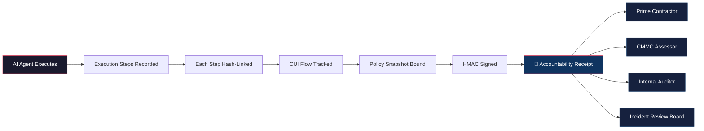

# Agent Accountability Receipt Schema v0.1.1

**An open standard for tamper-evident, CMMC-ready execution receipts for autonomous AI agents in regulated environments.**

Created by **Julio Berroa** · Published by [NeoXFortress](https://neoxfortress.com)

---

> AI agents are already making decisions inside defense contractors. Most cannot prove what happened. This standard fixes that.

---

## Architecture



---

## The Problem

Defense-tech and mid-size GovCon contractors are deploying AI agents internally — for RFP summarization, document search, report drafting, and workflow automation.

When a prime contractor, CMMC assessor, or Inspector General asks **"prove exactly what the agent did,"** there is no standardized, signed, auditor-ready artifact.

General tracing and observability tools exist. **Compliance-grade accountability artifacts do not.**

## The Solution

The **Agent Accountability Receipt** is a structured, hash-chained, HMAC-signed JSON document generated every time an AI agent executes. It answers:

- **What exactly did the agent do?** — Step-by-step execution tree with parent-child relationships
- **What data was touched?** — Hash-verified input/output references with end-to-end CUI flow tracking across boundaries
- **Which policy version was active?** — Immutable policy snapshot bound to each execution
- **Was a human in the loop?** — Structured evidence of what was presented, how long they reviewed, and what they decided
- **Can we verify it wasn't tampered with?** — Cryptographic hash chain + HMAC signature with tamper-evident seal
- **Was the run compliant?** — Self-assessed compliance verdict mapped to CMMC/NIST controls

## Who This Is For

- **AI Technical Leads** piloting internal agents at defense contractors
- **Engineering Directors** overseeing AI automation in regulated environments
- **Compliance Officers** preparing CMMC evidence packages
- **Auditors and C3PAOs** evaluating AI agent governance
- **Prime contractor reviewers** assessing subcontractor AI practices

## Schema Features (v0.1.1)

| Category | Capabilities |
|---|---|
| **Execution Tracking** | Step-by-step execution tree, LLM calls, tool calls, decision points |
| **Data Protection** | Hash-by-default (no raw content unless policy permits), CUI/PII/ITAR classification (rule-based in v0.1.1), end-to-end CUI flow tracking |
| **Policy Binding** | Immutable policy snapshot, approval records, guardrail events with denied action detail |
| **Human Oversight** | Structured checkpoint evidence — what was shown, presentation mode, reviewer action, review duration |
| **Integrity** | SHA-256 hash chain with machine-verifiable hex patterns, HMAC signature with explicit signed-payload declaration, optional Merkle tree for large executions |
| **Lifecycle** | Receipt revocation (with timestamp + attribution) and supersession, multi-receipt linkage (parent/child/retry/continuation) |
| **Compliance** | Self-assessed verdict with assessor attribution, violated control IDs, risk scoring, framework reference |
| **Provenance** | Agent code hash, deployment fingerprint, container image digest, SBOM hash, dependency lockfile hash |
| **Error Handling** | Step-level error capture with recovery action tracking |
| **Data Ref Guardrails** | Conditional validation: hash_only blocks content, redacted_text requires redaction metadata, binary_hash requires mime_type |

## Quick Start

```bash
# Clone the repository
git clone https://github.com/NeoXFortress/agent-accountability-receipt.git
cd agent-accountability-receipt

# Install dependencies
pip install -r requirements.txt

# Generate a demo receipt (RFP summarization scenario)
cd reference_impl
python3 generate_receipt.py

# Output:
#   PASS: Hash chain verified (6 steps)
#   PASS: HMAC-SHA256 signature verified
#   PASS: Receipt validates against schema.json
#   ALL CHECKS PASSED

# View the generated receipt
cat ../examples/demo-receipt.json | python3 -m json.tool
```

## Repository Structure

```
agent-accountability-receipt/
├── schema.json                        ← v0.1.1 JSON Schema specification
├── README.md
├── LICENSE                            ← MIT (schema) + proprietary notice
├── NOTICE                             ← Copyright attribution
├── requirements.txt                   ← Python dependencies
├── reference_impl/
│   ├── generate_receipt.py            ← Reference generator + verifier
│   ├── scenario_cui_blocked.py        ← CUI exfiltration blocked scenario
│   ├── scenario_human_rejected.py     ← Human checkpoint rejection scenario
│   └── scenario_revoked.py            ← Receipt revocation scenario
└── examples/
    ├── demo-receipt.json              ← ✅ Happy path: RFP summarization (6 steps)
    ├── cui-exfiltration-blocked.json  ← 🚫 Agent tried to send CUI to Slack, blocked
    ├── human-checkpoint-rejected.json ← ❌ Reviewer rejected hallucinated DFARS answer
    └── receipt-revoked.json           ← 🔒 Valid receipt revoked after key compromise
```

## Example Scenarios

| Scenario | Status | Steps | What It Demonstrates |
|---|---|---|---|
| **RFP Summarization** | `success` / `compliant` | 6 | Happy path: CUI detected, redacted at boundary, human approved |
| **CUI Exfiltration Blocked** | `failed` / `non_compliant` | 3 | Agent tried to send CUI to external Slack — guardrail blocked it |
| **Human Checkpoint Rejected** | `partial` / `review_required` | 5 | LLM hallucinated a DFARS regulation (24h vs 72h) — reviewer rejected |
| **Receipt Revoked** | `revoked` | 3 | Originally valid receipt revoked after signing key compromise discovery |

## Schema Structure

```
receipt          — Header: ID, version, schema hash, status, issuer, lifecycle, related receipts
context          — Who ran it, where (with deployment fingerprint), when, under what case/ticket
policy           — Which policy version, what controls, what approvals
execution        — Run metadata + ordered steps (LLM calls, tool calls, decisions, checkpoints)
data_handling    — Storage location, retention policy with enforcement proof, key management
integrity        — Hash chain, optional Merkle tree, HMAC signature with timestamp, attestations
compliance       — Verdict, assessor, violated controls, risk score, framework
cui_flow         — End-to-end CUI boundary crossing log with classification and redaction tracking
extensions       — Vendor/org-specific fields
```

## Design Principles

1. **Hash by default.** Raw content is never stored unless the organization's policy explicitly permits it. All hash fields enforce machine-verifiable hex patterns.
2. **Auditor-first.** Every field exists because an assessor, IG, or prime reviewer would ask for it.
3. **Self-hosted.** No cloud dependency. No data leaves the customer environment.
4. **Tamper-evident.** Cryptographic hash chain + HMAC signature. The signature explicitly declares what was signed and how it was encoded.
5. **Honest about limitations.** HMAC's shared-key non-repudiation gap is documented, not hidden. Classification is rule-based only in v0.1.1.
6. **Machine-verifiable.** Hash fields use regex patterns to reject malformed values at validation time. Conditional rules enforce consistency between representation modes and their required metadata.

## Schema Hash

The `schema_hash` field in every receipt contains a SHA-256 hash of the raw bytes of the published `schema.json` at the tagged git commit. This ensures two receipts claiming the same schema version are structurally identical. No reformatting, no whitespace normalization — the canonical form is the exact file content at the release tag.

## Versioning Notes (v0.1.1)

- **Classification mode**: `rule_based` only. Values `hybrid` and `manual_only` are reserved for forward compatibility but rejected by v0.1.1 validation.
- **Signature type**: `hmac_sha256` or `hmac_sha512` only. Asymmetric signatures planned for v0.2.
- **Merkle tree**: Optional. Linear hash chain is sufficient for typical agent runs (5-50 steps).

## Roadmap

| Version | Planned Additions |
|---|---|
| **v0.2** | Asymmetric signatures (ed25519/ECDSA), RFC 3161 timestamp authority support, hybrid/manual classification modes |
| **v0.3** | ML-assisted classification, multi-framework agent support |
| **v1.0** | Formal specification document, third-party validation suite, interoperability testing |

## Commercial Implementation

The **schema** is open (MIT License) to encourage adoption across the defense-tech ecosystem.

The **NeoXFortress Agent Accountability Engine (AAE)** — including the Python SDK, receipt generation engine, PDF export, CUI classifier, CLI verification tools, and local web viewer — is proprietary and available under commercial license.

For pilot inquiries: [Contact NeoXFortress](https://neoxfortress.com/contact)

## License

### Schema (this repository)

Copyright (c) 2026 Julio Berroa / NeoXFortress LLC

MIT License — See [LICENSE](LICENSE)

### Commercial Implementation

Copyright (c) 2026 NeoXFortress LLC. All rights reserved.

The Agent Accountability Engine SDK, receipt generator, PDF exporter, CUI classifier, CLI tools, and web viewer are proprietary software. Commercial license required.

---

**NeoXFortress** — AI Agent Accountability Infrastructure for Regulated Contractors

*Created by Julio Berroa · Built in Ashburn, Virginia for the defense-tech community.*
